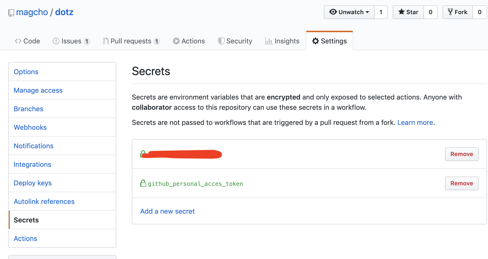

Goで作ったdotfiles管理ツールのdotzをビルド・バイナリ配布・homebrewのアップデートまでを自動化したメモ。

GitHub Actionsを初めて本格的に利用してみました。beta版の時はyamlにズラズラとshell scriptのように記述した覚えがありますが現行のactionsでは考え方が違うようです。

## github actions

現行のGitHub actionsについては日本語文献もたくさんあるので詳しいことはそっちを見てほしいんですが、GitHub上ではworkflowがpushやPR、タイマーなどのトリガーによって実行されます。workflow内には任意のactionを持ちこのactionが順次/並列で実行されます。

actionにはdockerのようにinputと環境変数を渡すことができ、任意の数のoutputができます。outputは別のactionのinputとして渡すことができます。

また、workflow内で使える環境変数にはリポジトリ名やcommit ハッシュ等の情報に加え、tagのpushをトリガーとした時などにはtag名等様々な情報を取得できます。さらにworkflowを実行しているリポジトリのみの権限を持ったonetime GitHub tokenが払い出されます。

github tokenは対象リポジトリにしか影響できないのでミスって他のリポジトリを消したりできないので安心。

## dotzのビルド

dotzに利用しているcli用のライブラリ[urfave/cli](https://github.com/urfave/cli)はコマンド実行時にツールのバージョンを表示する昨日はあります、今回はtag名からバージョン番号を拾ってmakefileでビルドします。

makefileはCIだけではなく開発時にも利用すると思います。開発時は`make`コマンド単体のみでビルドし、CI上のビルド時のみバージョン名を渡してビルドしたいです。このようにパラメータをオプション的に使うにはmakefile内で使える変数をコマンドラインから渡してやるといいです。

makefile内で変数`dotz_ver`を定義しておきます。

```makefile:title=makefile
dotz_ver = 0.0.0
build: main.go
	go build -v -ldflags "-X main.dotzVersion=${dotz_ver}" .
```

`make build`をしたときには`dotz_ver`の中身は`0.0.0`になりますが`make build dotz_ver=1.2.3`と呼び出せばコマンドライン側の値が優先され`dotz_ver`の中身が`1.2.3`になります。これを利用してworkflowからはtag名を渡しておきます。

```yaml:title=.github/workflows/build.yml
~~~~抜粋
jobs:
  build:
    name: build
    env:
      GO111MODULE: "on"
    runs-on: macos-latest
    steps:
      - name: Set up Go 1.13
        uses: actions/setup-go@v1
        with:
          go-version: 1.13

      - name: Check out code into the Go module directory
        uses: actions/checkout@v2

      - name: Build
        run: make build dotz_ver=${{ github.ref }}
~~~~抜粋
```

上記のmakefileにありますが、go build 時に`-ldflags "main.{変数名}={value}"`で値を埋め込んでいます。これでビルド時に変数を取り込み実行時は変数が格納済みの状態で実行が開始されます。

ビルド後は、[actions/create-release@v1](https://github.com/actions/create-release)と[actions/upload-release-asset](https://github.com/actions/upload-release-asset)でreleaseに生成したバイナリをアップロードします。

## homebrewの自動化

homebrewのformulaを自動更新するactionを作りました。

[https://github.com/magcho/dotz/tree/master/.github/actions/update_homebrew](https://github.com/magcho/dotz/tree/master/.github/actions/update_homebrew)

brewの公式リポジトリではなくオレオレformulaを対象としています。更新するactionとuploadするactionを分けたので後者を公式リポジトリにPRを送るactionに差し替えれば運用できるかなと思います。

内部でやっていることは既存のformulaをcurlで落とし、[ここで](https://github.com/magcho/dotz/blob/718af61a0ac6efa050e8ff718213d5f1a564350c/.github/actions/update_homebrew/src/main.js#L35-L36)バイナリのURLとsha256を更新しているだけです。

formulaによっては書き換えルールを追加しなければいけないかもですね。

formulaのtestとformatを掛けたのち、formulaをuploadします。formulaのリポジトリにpushしたいところですがworkflowに払い出される通常のGitHub tokenでは実行リポジトリ以外にpushできないので別途用意します。

[githubの個人設定](https://github.com/settings/tokens)からPersonal access tokenを払い出してリポジトリのSettingタブ->Secretsから任意の名前でsecretに登録しておきます。

 

あとはworkflowから`${{secrets.****}}`で参照できるのでtokenを渡しておきます。

```yaml:title=.github/workflows/build.yml
~~~~抜粋
- name: create commit
  run: |
    sh ./ci/create_commit.sh "dotz.rb" "magcho" "${{ secrets.github_personal_acces_token }}" "mail@magcho.com"
~~~~抜粋
```

これにてtag付きでmasterにpushすれば勝手にリリースまでやってくれるようになります。


## おわり

そういやGitHub actionsハッカソンがありました。気づいた時は最終日でしたが、、

github actions marketplaceに全然actionの種類がないなーと思ってたとこなのでハッカソンで一気に増えた感じですかね。自分もなんか出したかったな。
