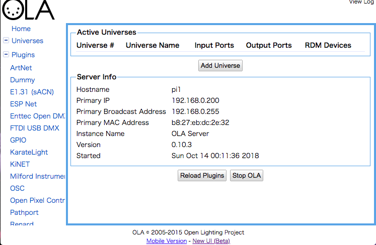
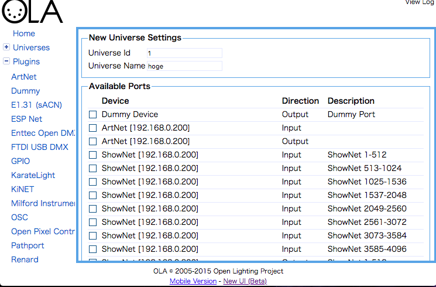
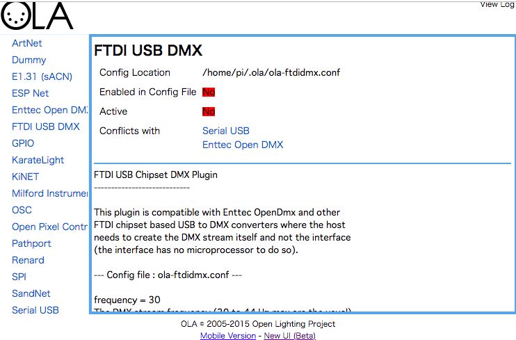
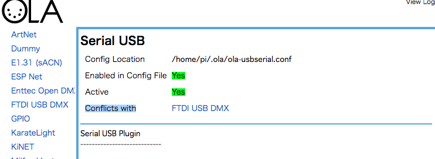
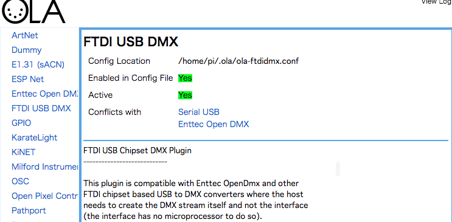

## OLA とは

[Open Lighting Project](https://www.openlighting.org/) という組織が開発をしています。この組織は、2004年当時、オープンな照明用のプロトコルArt-Netに目をつけた大学生がそれを活用できるようにOSSなどを整備していくことを目的に作られたものみたいです。[(※History)](https://www.openlighting.org/openlightingproject/about/history/)
OLAの他にもLinux系でArt-Net扱うためのライブラリであるlibartnetやrdmテスターなども製作しています。

その製作プロジェクトの一つであるOLA。これはDMX over Ethernetの各種プロトコルやUSBのDMXノード各種などの信号を変換するノードです。対応しているプロトコル、デバイスは[OLAのHP](https://www.openlighting.org/ola/)からも確認できます。

面白いのが、メーカーが仕様を一般に公開していないノードであってもOLAが対応している点です。開発者がロジアナなどで解析しているんだとか。


## OLAの使い方

OLAはLinuxとMacOS・FreeBSDに対応している。残念ながらWindowsには対応していないが公式HPではVMでUbuntuを動かす方法を紹介している。様々なプラットフォームに対応してるOLAだが操作方法は全て同じでWeb上のGUIで操作できる。


"Add Universe"ボタンを押して、Universe IdとUniverse Name を入力し、使いたいプロトコルにチェックを入れ、"Add Universe"を押すだけです、簡単ですね。


しかし、このままでは左に青字で書かれているPluginsのデバイスが右のチェックボックスに表示されていません。これはOLAはOLAがデバイスを認識していないためです。試しに何かしらのUSBデバイスを接続して"Reload Plugin"してみてください、一覧に表示されるようになったと思います

でもデバイスによっては接続しても表示してくれないものもあります、そのような場合は別途設定を行う必要があります。


## 表示されないデバイスを使えるようにする

ここでは、Raspberry piにFTDI USB DMXを接続する流れを説明していきます。

1. RaspberryPiがFTDIデバイスを扱えるようにルールファイルを作成します。詳しくは[公式Wiki](https://wiki.openlighting.org/index.php/OLA_Device_Specific_Configuration#Open_DMX_USB_.2F_FTDI_RS485)にも書いてあります。
  `/etc/udev/rules.d/10-local.rules`というパスに
  ```
  # udev rules for ftdi devices
  SUBSYSTEM=="usb|usb_device", ACTION=="add", ATTRS{idVendor}=="0403", ATTRS{idProduct}=="6001", GROUP="plugdev"
  ```
  を保存します、多分ルールファイルはデフォルトでは存在しないので新規作成してください。

1. 左のリストから"FTDI USB DMX"をクリックし、詳細を見ます。`Enabled in Config File`と`Active`がNoになっていますね。OLAで使用するためにはこの２つがYESになっていなければなりません。
  

1. まず、競合しているデバイスを停止させます`Conflicts with`に書かれているデバイスはこのFTDI　USB　DMXと同じドライバーであったり、物理的にポートが同じなどの理由で同時に使用できません。なので競合しているデバイスの方を止めます。
  
  `Config Location`に書いてあるパスに設定ファイルがあるので、編集します。
  ```
  device_dir = /dev
  device_prefix = ttyUSB
  device_prefix = cu.usbserial-
  device_prefix = ttyU
  enabled = true  <--------　falseに変更してください
  pro_fps_limit = 190
  tri_use_raw_rdm = false
  ultra_fps_limit = 40
  ```
  のようにenabledをfalseにします。`Enttec Open DMX`も同様です。

1. 次に`FTDI USB DMX`の設定ファイルを編集します。
  ```
  enabled = false <-- trueに変更してください
  frequency = 30
  ```
1. USBでデバイスを接続して`Reload Plugin`をすればYesになると思います。

