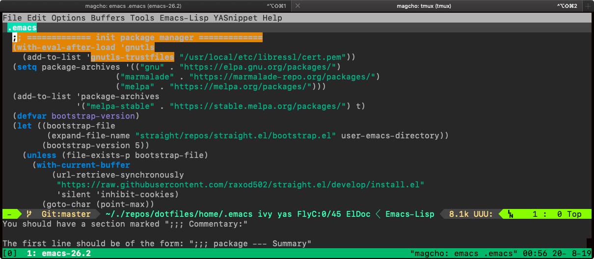
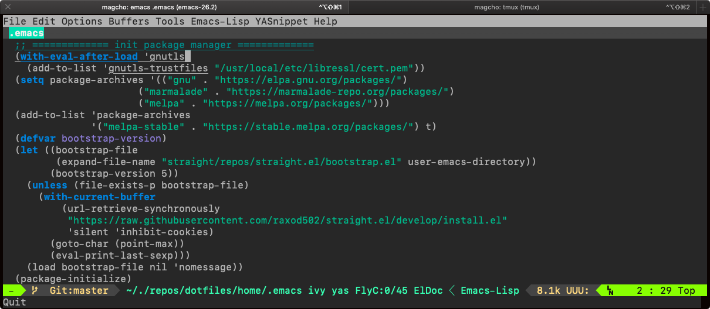
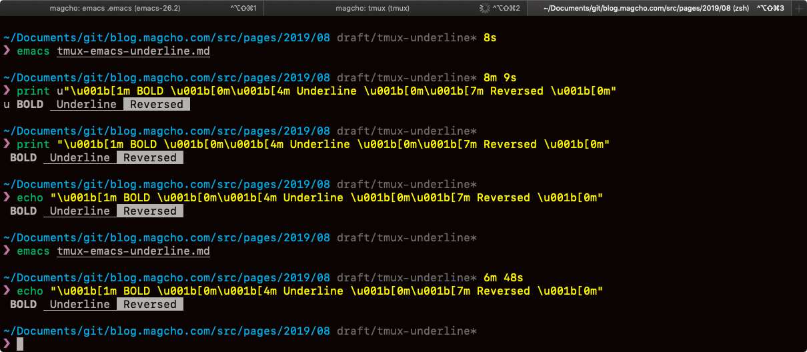

macOS(Mojave)でiterm2を使っています、emacsのテーマを設定していてunderlineが表示できなくて困りました。

emacsでは文字色や背景色のほか、<u>文字の下線</u>, **太字**,  *斜体* , ~取り消し~など色々な表記ができます。

自分の環境ではflycheckのerror, warningなどが下線付きの書式になるはずでした。

iterm2上で直接emacsを起動している時にはきちんと下線が表示されますが、tmuxセッション上でemacsを起動すると下線が表示されませんでした。




そもそもターミナル上でこのようにunderlineやboldなどの文字装飾を行う時はANSIエスケープシーケンスかなーと思ったんですが
iterm直接とtmux上で

```
print "\u001b[1m BOLD \u001b[0m\u001b[4m Underline \u001b[0m\u001b[7m Reversed \u001b[0m"
```

を表示させても正しく同じ表示になります、アレレ。


	

なのでemacsの設定が悪いのかと思って色々変えてみたんですが、結局はtmuxの設定でした。

もともと、tmuxには256色に対応させるために以下の設定をしていたんですが、それが原因だったようでscreenではなくxtermにすると改善しました。

```.tmux.conf
# これはダメ
set -g default-terminal "screen-256color"

# こっちにする
set -g default-terminal "xterm-256color"
```

ちなみにtmuxのQ&Aに書いてあった`tmux-256color`を設定するとemacsがエラーで起動しませんでした。

