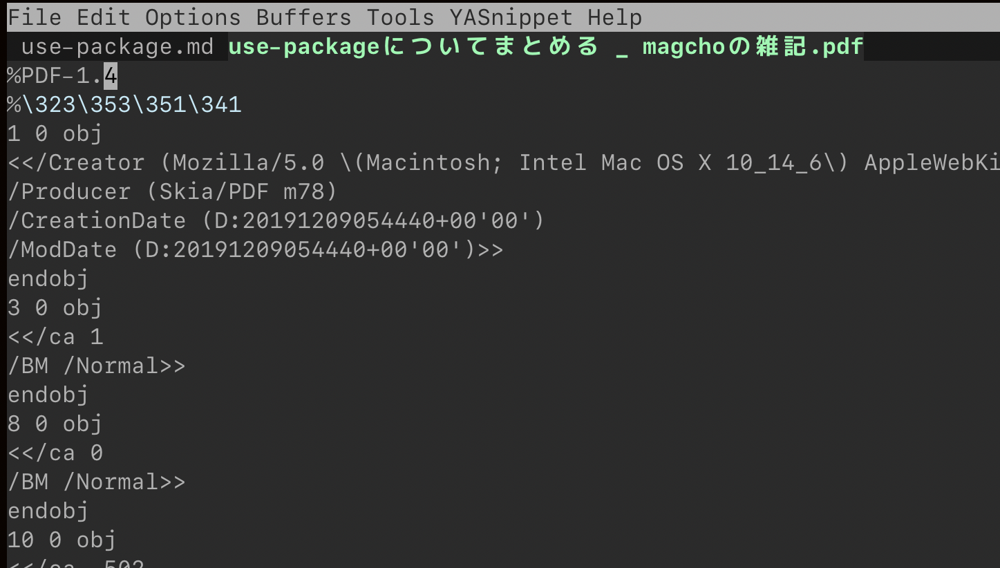
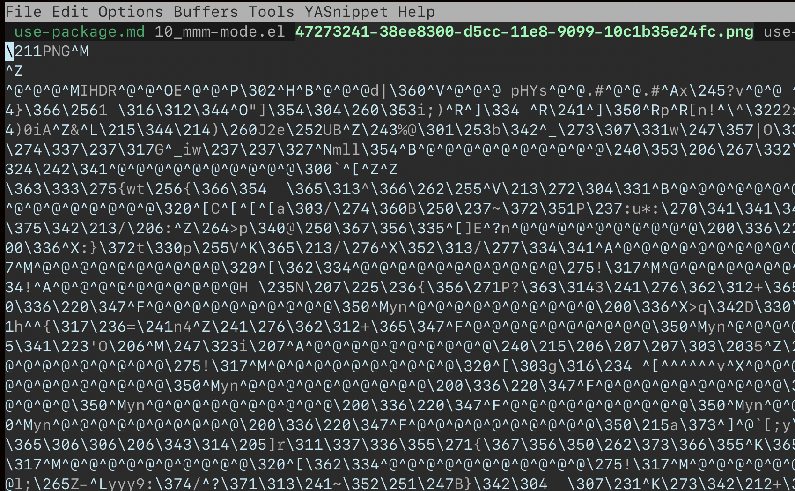

Emacsのパッケージマネージャーのuse-package.elにはパッケージインストールの他に任意のタイミングで評価させるキーワードというものがありますが、自分はこれをよく分からず使っているので調べてまとめます。

## 実行タイミング

評価の順番はこうなります

1.  パッケージ名の実在確認
2.  `:preface`
3.  `:if, :when, :unless`
4.  `:init`
5.  `:require`パッケージをロード
6.  パッケージをロード
7.  `:config`

インストールするパッケージの設定を記述するためのキーワードです。

### :preface

条件分岐キーワードを同時に使用していた時でも、条件分岐よりも先に評価されます。つまり、指定したパッケージ名が実在するならば真っ先に必ず評価してくれます。

### :init

パッケージが読み込まれる前に評価されます。遅延キーワードの影響を受けません。


### :config

当該のパッケージが読み込まれた後に評価されます。initに比べ、configは後述の遅延ロードを設定した際にパッケージがロードされるまで評価されなくなります。

## パッケージ設定

### :custom

パッケージの設定を書くキーワードです、`(setq ~)`と書いているのと同じことです。

```lisp
(use-package comint
  :custom
  (comint-buffer-maximum-size 20000 "Increase comint buffer size.")

  (comint-prompt-read-only t "Make the prompt read only.")
  (var-name var-value "comment"))
```

### :custom-face

パッケージにカスタムフェイスを適用できます。

```lisp
(use-package eruby-mode
  :custom-face
  (eruby-standard-face ((t (:slant italic)))))
```

## 遅延ロード

emacs起動時に全てのパッケージを読み込んでしまうと起動に時間が掛かってしまいます、そこで起動時には読み込まずにパッケージが必要になったタイミングで読み込ませる遅延ロードという仕組みがあります。

必要になったタイミングを検知する方法がいくつかあるため遅延キーワードも何個かあります。

### :defer

実はemacs自体に遅延ロードを記述する`;;;#autoload`があります、パッケージ内にこのコメントに続いて遅延ロードに関しての記述をすることでemacs側が良しなにしてくれるので、パッケージの開発者がautoloadを設定してくれている場合はuse-packageで遅延キーワードを書く必要はないです。しかし、:ifなどの条件分岐キーワードを同時に使っている場合は期待している動作にならないため、autoloadに従うことを明示的に宣言する必要があります。その場合は`:defer`キーワードをつけます。

その他、キーバインドなど自分で設定した項目を遅延ロードのきっかけにすることができます。以下のキーワードを用いて設定をすれば遅延ロードを自動で設定してくれます。

```lisp
(use-package perl-mode
  :defer t)
  
;; version2で指定秒数の遅延が追加されたようです。lspなど外部プロセスに依存するようなパッケージに有効ではないでしょうか。
(use-package perl-mode
  :defer 10)
```

### :commands

特定のコマンドを呼び出した時ににパッケージをロードします。`M-x`から呼び出した時のほかキーバインドに設定されていて、そのキーが押された時にも反応します。

```lisp
(use-package color-moccur
  :commands (isearch-moccur isearch-all))
```

:commandsキーワードに続いてカッコで囲って列挙すればいいみたいです。

### :bind

コマンドにキーバインドを割り当てます。:commandsキーワード+(bind-key ~)のことです。ここで割り当てるキーマップはローカルキーバインドを上書きをします。

キーバインドに設定する値は`(kbd xx)`と同じ指定方法を使えます。

```lisp
(use-package ace-jump-mode
  :bind ("C-." . ace-jump-mode))
```

:bindで設定するコマンドはパッケージ内でautoloadが設定されていることを想定しています、autoloadされていないコマンドのバインドを設定したい場合は:bind-keyを使用します。

```lisp
(use-package projectile
  :bind-keymap
  ("C-c p" . projectile-command-map))
```

### :mode, :interpreter

メジャーモードの設定を行います。:modeはファイル名もしくは拡張子に紐づけることができます。

```lisp
(use-package python
  :mode ("\\.py'" . python-mode))

;; パッケージ名がXX-modeとなっている場合は省略記法が使えます。
(use-package ruby-mode
  :mode "\\.rb\\'")
```

:interpreterはシバンで指定された言語のモードで開く設定です。

シバンはプログラムの1行目に`#!/bin/python`のように実行するインタープリターを指定する記述のことです。
この指定されたインタープリターを元にメジャーモードを判定します。

```lisp
(use-package python
  :interpreter python)
```

### :hook

他のコマンドが実行された時に、同時に実行したい時に使用します。
ファイル保存のコマンドが走った時にformatterを実行したい時などに便利です。

```lisp
(use-package formatter
  :hook save-buff)
```

### :magic, :magic-fallback

ファイルの先頭に指定する文字列がないか確認し、一致する場合に指定のモードで開きます。

emacsでテキストファイルでは無いものを扱う際にも便利なのでは無いでしょうか、もちろんテキストファイル(拡張子はjsだけど開きたいモードが違うとか)。docではpdfを例に挙げています。

```lisp
(use-package pdf-tools
  :magic ("%PDF" . pdf-view-mode))
```

試しにPDFファイルをemacsで開いてみるとこんな感じでした。確かに1行目に`%PDF`の記述があります。
 

文字列には正規表現が使えるみたいです。pngファイルをemacsで開くとこうなるので


```lisp
(use-package hoge
 :magic (".PNG" . hoge-mode))
```

こうすれば`.`が任意の1文字`(\211)`にマッチするので対応できます。

:magic-fallbackは拡張子がある場合はそちらを優先させるモード設定です。
モード指定の優先順序は:magic>:mode>:magic-fallbackとなっているので拡張子で判定するやり方とも共存できます。

### :demand

逆に必ず起動時に読みこませたい時には、遅延キーワードを書かないだけでは完全に遅延を止めることはできません。パッケージ自体のautoloadの効果により自動的に遅延ロードするようになってしまうので、これを阻止して必ず読み込ませるためのキーワードが:demandです。

```lisp
(use-package html-mode
  :demand)
```

## 条件分岐

### :if, :when, :unless

.emacsファイルを複数のOSで使い回す時などに特定のOSの時のみにインストールしたいパッケージがあるかと思います。そこで条件分岐を行いtrueになった時のみロードさせることができます。

```lisp
(use-package exec-path-from-shell
  :if (memq window-system '(mac ns)))
```

## 依存関係

ivyなどのパッケージの機能を強化するプラグイン的なパッケージをロードする場合、前提として大元のパッケージがインストールされていなければなりません、そこで依存関係を記述し自身のパッケージを読む前に依存パッケージをロードさせることができます。

### :requires

当該のuse-packageを読み込む直前のタイミングで依存パッケージもロードします。遅延を行なっている場合は当該のパッケージの読み込みタイミングに従います

```lisp
(use-package addrev
  :requires foo)

(use-package addrev
  :requires (foo bar))
```

### :after

当該のパッケージを指定のパッケージがロードされた後に続けてロードさせることができます。当該のuse-package句を読んだタイミングではなく、afterに指定したパッケージの読み込みタイミングまで当該パッケージの読み込みを遅延します。

以下の例ではivyとhydraがどちらもロードされた直後のタイミングまで当該パッケージの読み込みを遅延します。

```lisp
(use-package ivy-hydra
  :after(ivy hydra))
  
;; もしくは
(use-package ivy-hydra
  :after(:all ivy hydra))
```

以下の例ではivyもしくはhydraのどちらか一方がロードされた直後のタイミングになります。

```lisp
(use-package ivy-hydra
  :after(:any ivy hydra))
```

`:after(:any(:all A B) (:all C D))`のように:allと:anyを組み合わせることも可能です。
	
## インストール元を指定する

配布されているリポジトリを指定したり、ローカルにあるパッケージをロードさせるための記述です。

### :load-path

ローカルのファイルパスを指定します。

```lisp
(use-package my-package
  :load-path "~/emacs/my-package-dir")
```

### :pin

パッケージを取得するリポジトリを指定できます。デフォルトではmelpaから取得し、melpaに存在しない場合はemacsに設定されているリポジトリを順次検索します。

また、use-packageではなく手動でインストールしたパッケージもmanualを指定すればOKです。

```lisp
(use-package hoge
  :pin gnu)
  
(use-package org
  :pin manual)
```

## モードライン

モードラインに表示するXX-modeの記述を消したり、変更したりできます。

### :diminish

モードラインの表記を消すには:diminishにモード名を指定します。モードラインに表示されている名前でではなくモード名を指定します。大抵の場合はXX-modeという形を取っています。表示を変更することもできます。

```lisp
;; 表示を消す
(use-package addrev
  :diminish addrev-mode)
  
;; 表示を変更する
(use-package addrev
  :diminish (addrev-mode . "AddR"))
```

### :delight

diminish同様モードラインの表示を消したり変更したりできます。こちらの方が高機能？らしいです。こっちの方が記述が少なかったりマイナーモードに加えてメジャーモードの表示も変更できます。

```lisp
;; 表示を消す
(use-package addrev
  :delight addrev-mode)
  
;; 表示を消す(短縮記法)
(use-package addrev
  :delight)

;; 表示を変更する
(use-package addrev
  :delight (addrev-mode "AddR"))
  
;; 変数を利用して表示名を変更する
(use-package projectile
  :delight '(:eval (concat " " (projectile-project-name))))
```


## 無効化

### :disabled
(use-package)句を全て無効化し、スキップします。:disabledをつけるとパッケージのロードのほか設定などすべての項目を評価しなくなります。

```lisp
(use-package hoge
  :disabled
  :config
  (message 'abcde))
```

## バイトコンパイル関連

### no-require

設定を書いているファイルをバイトコンパイルするとエラーでうまく動かなくなったとき用設定？

```lisp
(use-package hoge
  :no-require
  :config
  (message "hogeが読み込まれたタイミングで評価される"))
```

### :defines, :functions

use-packageでは遅延ロード等で当該のパッケージが読み込まれた後にしか評価されない:configなどがありますが、バイトコンパイル時には遅延によりパッケージを読み込んでいないので未定義エラーになることがある様です。これを避けるため同名でダミーの変数、関数を宣言しておき、当該のパッケージをロードしたときに上書きする様にしておくことでエラーを回避するテクニックのようです。

```lisp
(use-package ruby-mode
  :functions inf-ruby-keys
  :config
  (defun my-ruby-mode-hook ()
    (require 'inf-ruby)
    (inf-ruby-keys))
  (add-hook 'ruby-mode-hook 'my-ruby-mode-hook))
```


## use-packageのextension

通常のuse-packageには実装されていない機能を追加するパッケージがあります。別途extensionを読み込むことで追加機能が使えます。

### use-package-chords

複数キーの同時押し、または単一キーの複数回押しをキーバインドに設定できます、内部的に[key-chords](http://www.emacswiki.org/emacs/key-chord.el)を利用しています。

```lisp
(use-package use-package-chords
  :ensure t
  :config (key-chord-mode 1))
```

```lisp
(use-package ace-jump-mode
  :chords (("jj" . ace-jump-char-mode)   ; jの2回押し
           ("jk" . ace-jump-word-mode)   ; j -> kの順で押した時
           ("jl" . ace-jump-line-mode))) ; j -> lの順で押した時
```

### :ensure-system-package

依存関係があるのはemacsパッケージ間だけとは限りません、lspやprettierなど実行バイナリに依存しているパッケージもありますね。

prettierコマンドがある時はパッケージをロードし、無い場合はOSのパッケージマネージャを用いてインストールを試みます。(macOSならhomebrew, ubuntuならapt)

```lisp
(use-package use-package-ensure-system-package
  :ensure t)
```

```lisp
;; rgコマンドがなければ brew install rg を試みます
(use-package rg
  :ensure-system-package rg)
  
;; コマンド名とインストールの時に指定する名前が違う場合
;; rgコマンドがなければ brew install ripgrep を試みます
(use-package rg
  :ensure-system-package (rg . ripgrep)
  
;; brewでは無いパッケージマネージャーを使う時
(use-package prettier-mode
  :ensure-system-package (prettier . "npm install -g prettier")
```

さらにコマンドでは無いアプリケーションでも大丈夫みたいです、使うかなこの機能？

```lisp
(use-package dash-at-point
  :if (eq system-type 'darwin)
  :ensure-system-package
  ("/Applications/Dash.app" . "brew cask install dash"))
```

## まとめ

とりあえずdocにあるものは全て書けたかなと思います。冗長になってしまいましたがこれでしばらくはuse-packageで迷うことはなさそうです。

ここまで書いておいてアレ何ですが、use-packageを調べていて何度も見かけた[leaf.el](https://qiita.com/conao3/items/dc88bdadb0523ef95878)がとても気になっています。
