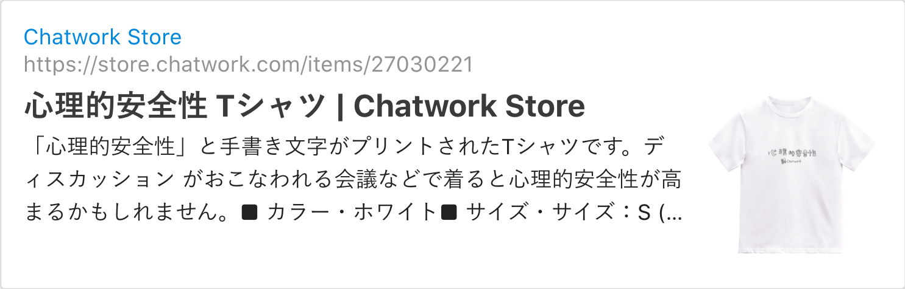

Chatworkさんの2020年夏のインターンシップのフロントエンドコースに参加させていただきましたレポ。オンライン開催ということでどんな３週間になるのかと不安と期待でいっぱいでしたがとても楽しくたくさんのことを得られたと感じています。

この手のエントリーは守秘義務契約に違反してしまいそうで避けていたのですが、自分が実際にエントリーするときに過去の参加者のレポを参考しましたし、これも誰かの参考になればと思いレポします。

Chatworkさんのインターンシップ自体が2019年に初めて行われ、内容はバックエンド(Scala)のコースのみだったようです。２回目となる2020年には去年に引き続きバックエンドと合わせてフロントエンドコース(React.js)が併設された形のようです。インターンシップは一周目の講義パート・２〜３週目の実務パートの延べ３週間行われました。講義パートでは全員で受講する講義に加え、front/backにそれぞれに別れ講義・ハンズオンを受講しました。

実務パートではfront/backのインターン参加生混合のチームが２チーム作られ。それぞれに完全に分かれて作業を進めて行きました。社員さんに加えて去年インターンに参加された方がメンターとして３週間一緒に参加してくださいました。

## 参加が決まるまで

みなさんご存知**魔法のスプレッドシート**を見て開催されること知り、去年度の参加者のレポを見て講義パートの存在が気になり応募しました。

正直自分には開発のバイト経験も、目立ったインターン経歴もチーム開発経験もないので受かるといいな〜ぐらいの気持ちでゆるっとエントリーし面談に進みました。

面談はオンラインで人事の方１名とエンジニアの方2名とのオンライン面談でした、とても話しやすい雰囲気で何に興味ある〜？とかチーム経験ある〜？とかをお話ししたと思います(多分)。あとは設計について知識があるかと聞かれて**「デザパタ本を読んで挫折しました」**と答えた覚えがあります。なぜインターン受かったんでしょう？

その後もゆるっとお話して面談は終了しました、あっという間の１時間でした。そして面談が終わり一息つく間も無く合格のご連絡をいただきあまりにトントンと話が進むのでこれは最後に高い絵か壺を買わされるやつでは？と考えたほどです。

## 参加まで

事前資料として「[りあクト！ TypeScriptで始めるつらくないReact開発 第2版](https://oukayuka.booth.pm/items/1312652)」を送りいただき、一通りReactについて学びました。最後にReactを書いたのがこのブログを作った時以来なので当時覚えていた記法等が本書内でレガシーとして紹介されていたのでこの分野の移り変わりの速さを実感。また講義パートの資料の一部を事前に送って頂いたのですが、中身を見ると初めての概念やお話ばかりで圧倒されムムムと唸りながら読み進めて行きました。

## 講義パート

1周目は講義パートと題して様々なテーマが設けられ実際にその分野でChatworkに携わっている社員さんに講義形式でお話を聞いたりハンズオンをしたりと盛り沢山の１週間です。

講義は全てGoogle Meet上で行われます。内容はChatworkについてやチーム開発に必要な概念や手法・設計などのお話から実際にChatworkが運用されているアーキテクチャなど幅広く盛り沢山でした。

今まで技術的なことにしか興味がなく、自分にはマネジメント等の分野はイヤイヤ技術者試験のために勉強してたぐらいでしたが、今回の講義で必要だしなんだか面白いぞと気づかされました。やっぱり書籍で紹介されるような用語紹介よりこういった生きたお話を聞けるのはとても良いです。

受講する講義に合わせてハンズオンも行われました。オンラインホワイトボードツール？のMiroを用いました。内容はオフラインで行っていたものをオンライン向けにアレンジしているっぽかったです、オンラインでもかなりワイワイと出来て楽しいです。この辺りでオンラインであることの不安はなくなりました。

毎日誰かしらが「心理的安全性」という言葉を使っていたので、それがとても印象に残った1周目でした。

Tシャツもあるそうです かわいい

## 実務パート

実務パートではインターン用にベースとなる小さなWEBアプリケーションが用意されていて、プロダクトオーナーからの要望に答えられるように既存のWEBアプリケーションに手を入れて行きます。

1週間を１つのスプリントとして設定し、2,3週なのでそれが２個ある形です。

既存のアプリケーションはScalaとReact.jsで実装されています。人生初体験だったのですが完全なGitOpsが組まれておりGithubのPRなどにhookしてビルド・チェックが走りビルドが成功するとChatworkにBot通知が届きポチポチするとk8s上にデプロイされます！完全に**魔法**です。すごい。このようなフローが組まれた状態のWEBアプリに手を加えて行きます。

講義パートで学んだ手法を用いたり、お手伝いいただきながら設計をして行きます。チーム全員で認識を合わせながら議論を進め、この設計パートにかなーり時間がかかってしまいました。時間をかけたのにかかわらず、これでよかったのか？？とモヤッとした気持ちを拭えないまま1stスプリントの設計を終え、フロントとバックに別れて実装に取り掛かります。

モヤッとした予感は的中し、1stスプリントはうまくいかずスプリントレビューで反省と来週以降の動きについてアドバイスをいただきながら考えていきました。

2ndスプリントも同様に計画、実装という流れで進めます。先週の反省から工数見積もりを修正、細かく進行度合いを見てきます。おかげでワイワイと事が進み。先週のお通夜が嘘みたいです。さらに今週は少し余裕があるので、ドメインについて議論をしながら進めて行くことができました。先週はこういった議論ができませんでしたが今週は個々の考えていることをそれぞれ出し合って議論を進めることができるようになってきました。**これが心理的安全性ってやつか**

今週はちゃんとデプロイもできてみんなで追加した機能が動きました。**めでたい！**そしてみんなで新機能を連打したり、あえて変な操作をしたりとバグを探し初めます、みんな悪い人たちですね。おかげで色々とボロが見つかりました。詰めが甘い、、ちなみに会社としてバグバウンティー[^1]や、社内でバグ探しイベント[^2]もされているそうです。楽しそう

[^1]: https://bugbounty.jp/program/UFjXG0kdqwZhmULIjBFOojK5
[^2]: https://www.wantedly.com/companies/chatwork/post_articles/188911

## 終わりに

とても楽しく、感謝しきれないほどたくさんのものが得られました。どれくらい感謝しているかというと、オフィスの方を足にして寝るのをやめました。

コーポレートミッションとして「働くをもっと楽しく、創造的に」を掲げている通り、楽しく働くことを常に考えていて実際に楽しく働くための仕組みや社員の方もそれを実現・体現していく雰囲気を感じました。インターン中は分報のようなチャットがあり、業務時間のはずなのにすぐに返信が来ます。~~いつ仕事しているのか疑問でした~~（失礼）

実際にチーム開発をしてみて感じたこととして、マネジメントはPMだけが頑張って考えるものだと考えてましたが、エンジニアこそこういった手法のことを知っておこうと考えが変わりました。今は講義パートで紹介していただいた書籍何冊かをポチって**あっ！これインターンでやったところだ！**といいながら読み進めています。

最後に、オフィスが大阪の梅田・東京タワーの横にあるためかお話しした社員さんやメンターさんが必ず近所の美味しいご飯屋さんの話をします。こちとらUberEatsすら対応していないような町に住んでいるので毎日コンビニおにぎりでした。悔しい
