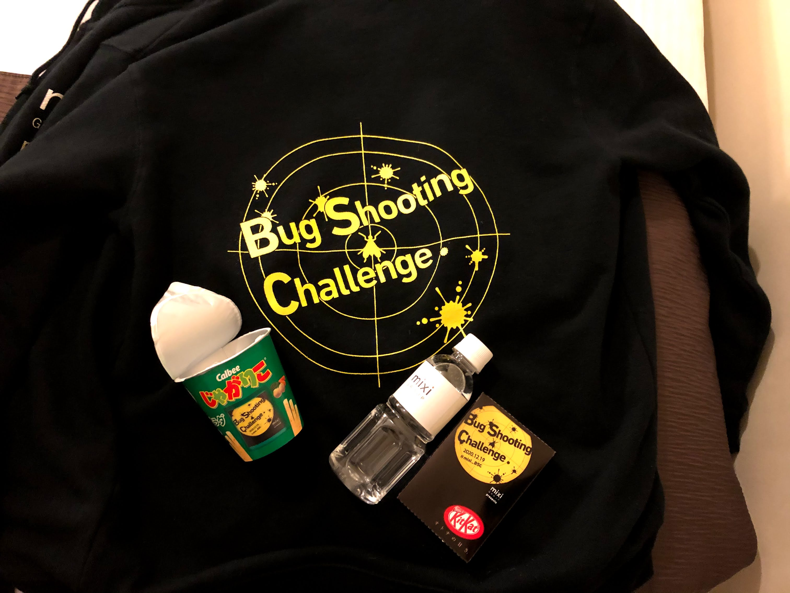

## イベントについて
先週[Bug Shooting Challenge #5 ONLINE](https://mixi.connpass.com/event/193415/)に参加させてただきました。

問題の背景としては、すでにリリースされているwebゲームのCREチームとして配属され、ユーザーからのお問い合わせや社内の調査チームからの報告を元にバグを探していくというものです。

お題のゲームはRailsで作られており、コードとdocker-compose.ymlが入ったgitリポジトリーを渡されます。さらに、サーバーのログがBigQueryに蓄積されているので、参考にできます。

問題は全3問あり、ペアでチームを組みそれぞれで問題に取り掛かります。ログを解析をした経験もBigQueryを使った経験もなかったのでチュートリアル問題で何から初めていいかわからず心が折れそうになりますが、露骨なヒントも頂けるので**何にも分からん**ことにはならないので安心です。

今回のイベントはチーム対抗戦です、バグを探す・issueに原因を報告する・コード修正のPRを出すことで完答です。もちろんヒントが出る前に自力でバグを見つけられるとプラスになります。

## ノベルティー
 

オリジナルパーカーとおやつ・ステッカーを開催前に送っていただきました。嬉しい

おやつにはロゴが入っておりノベルティーへの熱が伝わってきます。イベント前にいただいたのでますます当日が楽しみになってきました。

## オンライン
期間中はRemoをずーっと繋いで互いの画面を共有し、あーだこーだ言いながら進めていきます。Remoは複数の人が同時に画面共有できて便利ですね。

今回ペアになった方とは当日初めましてだったので不安でしたが、同い年ということもあり楽しく進められてよかったです。すごい人でした

## 競技
1問あたり1時間ちょっとぐらいの全３問。各問題終了後ごとに答え解説があるのでチームの２人で「なるほど〜」と言いながら答えを見ていました。

1問目は**何にも分からん**だったのでヒントを聞いて多分ここだなーとissueに書いたところでタイムアップでした。

2問以降はアタリの付け方がわかってきてヒントが出る前に見つけることができるようになりました。相方のBigQueryのクエリ捌きがプロでした。助かった。

## やってみて
最初の情報はユーザーからの報告なので、ユーザーに見える範囲しか情報がありません。この情報とログ・実装をどう関連付けて検証していくかについてコードを書く以外のドメイン知識だったりと様々なスキルが必要でした。

各問題の毛色が違ったので、ログを元にユーザーの行動を追ってみたり、バグが再現しないか試したりと様々なアプローチがあることを体感できとても楽しかったです。

## イベントについて
commpass上の掲示で開催を知り応募しました、応募要件にRailsの知識が挙げられていましたがRails周りの知識を問われることはあまりなく、webアプリをなんかしら作ったことがあれば大丈夫そうです。競技の本質はそこではなくログ・DBを元に答えが探せるかというところだと思います。

mixiさんは他にもGitとUnityのchallengeイベントを開催おり、次回は応募してみようかなと思ってます。
