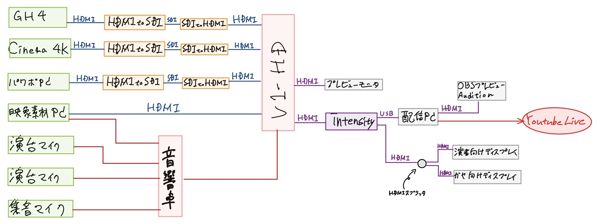
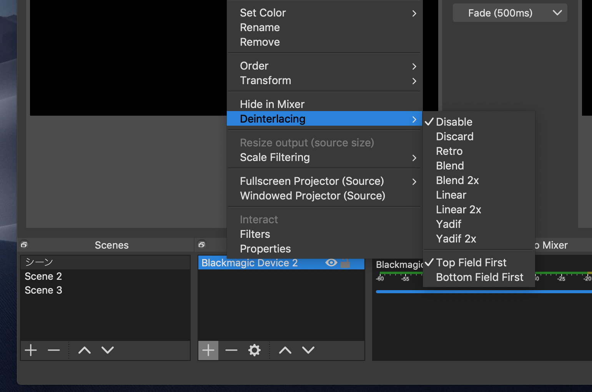

感染防止などの理由でいつもは集まって行なっていたミーティングができなくなってしまったので、今回youtube liveでリアルタイム配信をやってみたレポートです。

使用した機材やつまづきポイントなどを書いておくので何かの助けになれば幸いです。

## 事の発端

大学のサークルにて月に一回所属している人を大教室に集めて情報共有などを行う習慣があり、2月までは大教室に付属するプロジェクターとマイクを用いて講義のような形式で行なっていた。しかし3月は感染防止の観点から大学側より集会禁止の通知が届いたため中止に。

この時期は大学のサークルということもあり新歓などで慌ただしく情報共有の場が必要でした。その他のことも忙しい時期らしい。なので予定していた日付はそのままで配信集会をやろうということになった。

## 配信準備

今回使用した機材は以下

- ビデオミキサー V-1HD Roland
- PC (配信用, 映像素材出し用, パワポ用)
- カメラ GH4 Lumix & Dock
- カメラ Blackmagic Pocket Cinema Camera 4K BlackmagicDesign
- マイク 2本 AT808G AudioTechnica
- 集音マイク RTA-M dbx
- 音響卓
- ビデオキャプチャー blackmagic intensity shuttle blackmagicDesign
- SDI-HDMIのコンバータ blackmagicDesign

なんだかごちゃごちゃですね、普段は映像撮影とかPAとかしているサークルなのであり合わせの機材です。

## カメラ

要件として電源を繋いで常時給電ができ、リアルタイム映像が出力できるカメラでないといけません。詳しくないんですがコンデジではリアルタイム映像が出力できなかったりするらしい。

さらに配信に向けてバッテリー残量や撮影モードなどのステータスなどが出力されないものが好ましいです。表示の消し方は事前に調べて設定しておかないと本番でグダリます。非表示にできないカメラも多いらしいので要事前調査。

GH4はAFアイコンの消し方がわからず本番時はMFでカメラ係が頑張ってました。映像伝送は長く引き回せるようにSDIに変換しています。

## ビデオミキサー

配信の構成として司会+喋る人の2人がカメラ前にいて、2人が映る引きの絵(カメラ固定)としゃべっている人を1人だけ写すためのカメラの2台構成です。

喋る時にはパワポを写して、ワイプでしゃべっている人を出したかったのでビデオミキサーを用いて映像を混ぜています。

この操作が難しくてミスしょっちゅうミスする、、、どのボタン押せばパワポだっけ？？ってなるのでプロの方の偉大さを実感できます。

## マイク

出演者は2人固定なので2本の演台マイクを設置、さらに控えている人もどうせ喋るだろうと思ったので天井から無指向性マイクをぶら下げてみました。音響卓で出演者より小さめに控えている"ガヤ"の声を混ぜるといい感じです。

配信をみている人は1人でイヤホンか何かで聞いていると思いますが、演台マイクはリップノイズだったり環境音だったりを結構拾います。変な言い方ですが未処理の音声にはリップノイズやら鼻息やらでイヤホンでずっとは聴いていられないと思うのです。なので誤魔化す意味も含めてガヤを入れてみました。BGMをうっすら流しておくのも効果あると思います。

## 使用ソフト

- パワポ用PC(Windows)
  - PowerPoint Microsoft
- 映像素材出し用PC(mac)
  - ProPresenter Renewedvision
- 配信用PC(mac)
  - OBS Open Broadcaster Software
  - Audition Adobe
  - soundflower

パワポと素材はビデオミキサーに入力しています[ProPresenter](https://renewedvision.com/propresenter/)というのは現場で映像屋さんに教えてもらったプレゼン用のソフトウェアです。映像を出力しながら次の映像素材のチェックのための再生を手元の画面にだけ写せるなど業務用のソフトウェアです。

日本語化はされておらず、業務用なので日本語情報がほとんどありませんが商用なので公式のDocumentがしっかりしています、ご興味があればぜひ。試用期間内なら制限なく無料で使えます。

OBSは配信用のソフトウェアとしてかなりのシェアのあるOSSです。日本語情報も多く戸惑うことはなさそうです。キャプチャーボードによってはOBSが認識しないため、一度別のプロトコルに変換するなど手間をかけるものもあるらしいですがBlackmagic社のキャプチャーボードはOBSに認識されますので安心です。

見逃しがちなのですが、配信の中で音声の大きさがバラバラだと少し問題になります。数年前のyoutubeでは動画自体の音量が小さくで端末のボリュームを大きくしたらCMが流れてきてCMの音が大きくてビックリする！なんてことがあったんですが、そこらへんをyoutubeが自動的に動画の音量を調整してくれるようになってます。「youtube ラウドネス」で検索すると情報が出てきますので気になる方は是非。

そんなラウドネス規定ですがyoutube公式に値を発表していませんが動画では-13LUFSを超えるとyoutube側で調整が入ると言われている？らしいのでyoutube liveがどうなのかはわかりませんがこれに合わせてみました。測定にはAuditionのラウドネスメータをを用いています。Auditionの[エフェクト]->[スペシャル]->[ラウドネスメータ]から呼び出せます。

さらに今回のマイク配置で演台マイクと無指向性マイクの音を拾うエリアが一部かぶっていたので位相モニタ？ができるVSTプラグインFlux Stereo Tool v3を表示させています。これは以前現場でバウンダリーとワイヤレスのピンマイクの両方で集音していたらワイヤレスの方が半周期分遅延してミキサーに入力されたため電話越しのような音になってしまった経験があるので一応確認します。実のところモニターの詳しい見方がわからないのですが画面上でピカピカしていると気分が上がるので100点です。

## ハマりポイント

今回初めて配信をやってみて苦労した点、次回改善したい点を挙げておきます。誰かの助けになれば幸いです。

### 1.カメラからの入力がチラつく

今回使用したビデオミキサーはRoland社のV-1HDです。機器背面のスイッチにて入出力するHDMIの方式を設定できます。PCや民生用プレイヤーなどではHDMIのコネクション確立時に受け手側の画面サイズを検出して出力サイズや方式を自動で合わせてくれますが今回使用したカメラは2台ともそうではなかった。

V-1HDには背面スイッチで(1080i, 1080p, 720p)に切替が可能です。キャプチャーボードのintensityの入力仕様も見ると1080でキャプチャするには1080i/50iまたは1080i/59.94のどちらかを使用することになります。

するとV-1HDに入力するにはカメラ側の出力設定を1080/59.94i, 1080/50i, 1080/59.94p, 1080/50pのどれかに設定する必要があるのです。普段民生機しか触らない身からするとPCは繋いで映るのにカメラは映らなくて半日ほど悩みました。類似の事象を検索するもこういうことはプロに任せる分野ですからほとんど情報がありません。後で聞いたらそういうものはビデオミキサーに入力する前に信号形式を変換してミキサの形式に統一して運用するものらしい。確かにブラマジのHPにそういう製品あったな。

設定方法はカメラごとにだいぶ違いますし、そもそも設定できない形式もあります。事前にカメラ・キャプチャーボード・ビデオミキサの入出力仕様を調べてプランニングしておくべきです。

### 2.配信画面のインターレースを解除できない

これは完全に調査ミスです。intensityの仕様から1080/50iでキャプチャしましたがyoutube liveサーバーはプログレッシブを受けます。intensityの設定でデインターレースできないかと探しましたが。OBSにデインターレース機能があるようです。次回からはこれを使います。

### 3.BGMに著作違反がありアーカイブが公開できなかった

youtubeはJASRAC楽曲に対応しているので配信前は深刻に考えていませんでした。実際に動画で著作音源を仕様した経験があるが広告収入を著作主に配当させる設定を行うことで動画の公開ができていました。

JASRACで管理されていない楽曲や管理されていてもyoutubeなどで使用することを認めていない楽曲もあり、そういった場合は配信終了後にーカイブを配信停止されてしまいます。

youtubeのWEB UI上で当該の楽曲が使用されている部分を無音にするか動画を切り詰めるかを選択することができます。今回BGMを流していた部分は配信開始までのカウントダウンを行うシーンと配信終了後のテロップ部分だけでした。なのでここをトリミングすることでアーカイブを配信できます。

youtubeは著作的な問題が起こっても対応手段を提供してくれるのでとてもありがたいです。が今回のようにクリッピングを行なった際には生配信中のコメントが全て消えてしまうようです。それを考えると著作には気を配るべきでした。

### 4.音ズレ・音割れ

配信時には気がつきませんでしたがアーカイブを見ると映像が音声より0.3秒ぐらい遅れていました。OBSにて映像にディレイをかけられるので配信時は本番前のプレビューをyoutube上で確認しながら調整すると良さそうです。

今回音響卓からのアウトをV-1HDのAudio INに入れてみました。受け手側で音のレベル調整をして60あたりにセットしましたが(デフォルトは100)これはアッテネーターではなくビデオミキサー内のミックス用のレベルなようです。音量は下がっても受け手側でピークになるレベルは変わらない。なので別途アッテネーターやプリアンプのようなものを用意するのが良さそうです。

## 慣れている人に聞いたこと

普段からに関わっている人にお話を聞けたのでここにメモしておきます。

### 音声レベルに注意

こういったプロの演者さんでない場合はマイクに向かって笑い声や咳などをしてしまうことがありがちだそう。コンプ・リミットをかけておくと少し安心。

### 配信終了後はしばらく放置

実際に配信してみるとユーザーの手元のスマホなどに映るまで30秒以上のラグがあります。しかし配信が終わってyoutube上の配信終了をクリックするとユーザーの画面は即時に配信終了となってしまいます、下手すると最後の30秒は配信を見れずに終了してしまうことに。なので配信自体が終了してもロゴやテロップを数分流しておく必要があります。

企業の配信などで「ご視聴ありがとうございました」の文面が3分ぐらい流れているのはそういった理由らしい

## 終わり

今回配信してみて感じたことは、難しいことはプロに頼もう
