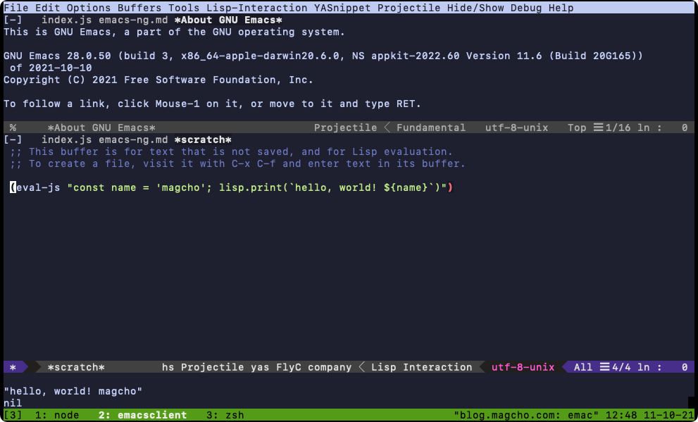

 

https://github.com/emacs-ng/emacs-ng

先日emacs-ngという通常のEmacsをfork[^1]しRustのWebrenderとDenoのランタイムを加えたプロジェクトを見つけました。READMEに記載されているように、完全な別プロジェクトというわけではなく定期的に本家のEmacsのmasterブランチの変更を取り込み、あくまでも現行のEmacsに新しいアイディアを付与するというプロジェクトらしいです。

現在のemacs-ngは本家の2021年8月24日時点のmasterを取り込んでいるためネイティブコンパイルも利用できます。

Ubuntu向けのバイナリであれば[GitHub Release](https://github.com/emacs-ng/emacs-ng/releases)で配布されていますが、MacOS向けのバイナリは配布されていないので自前でビルドする必要があります。ビルド方法は[ドキュメントページ](https://emacs-ng.github.io/emacs-ng/build/building/#macos)に記載されていますがPATHが足りないなどうまくビルドできなかったので[Github Actions](https://github.com/emacs-ng/emacs-ng/blob/master/.github/workflows/test.yml)を参考に以下の手順でビルドできました。

```bash:title=build-maxos.sh
rustup install $(cat rust-toolchain)

cargo install cargo-cache --no-default-features --features ci-autoclean cargo-cache
cargo-cache

# brew install texinfo automake gnutls autoconf llvm libgccjit

export PATH="/usr/local/opt/llvm/bin:$PATH"

export PATH="$HOME/bin:$PATH"
export CPATH="$CPATH:/usr/local/Cellar/libgccjit/11.2.0/include"

./autogen.sh

export PATH="/usr/lib/ccache:/usr/local/opt/ccache/libexec:$PATH"

export CC=clang
export CXX=clang++
export CPP="clang -E"
export CFLAGS=" -g1 -O2"
export CXXFLAGS=" -g1 -O2"
export AR=llvm-ar
export AS=llvm-as
export RANLIB=llvm-ranlib

export CARGO_INCREMENTAL=0
export RUSTFLAGS="-Zshare-generics=y -Cdebuginfo=1 -Copt-level=0"

export CPLUS_INCLUD="$(/usr/local/opt/llvm/bin/llvm-config --includedir):$CPLUS_INCLUDE_PATH"
export LD_LIBRARY_PATH="$(/usr/local/opt/llvm/bin/llvm-config --libdir):$LD_LIBRARY_PATH"
export CFLAGS="$CFLAGS -march=native"

export LDFLAGS="$LDFLAGS -L/usr/local/Cellar/libgccjit/11.2.0/lib/gcc/11"
export CXXFLAGS="$CXXFLAGS -march=native -L/usr/local/Cellar/libgccjit/11.2.0/lib/gcc/11"
export RUSTFLAGS="$RUSTFLAGS -Ctarget-cpu=native"

./configure --with-json --without-x --with-native-compilation

make -j$(nproc) 
```

makeコマンドによりrust部のコンパイル->emacs部のコンパイル(gcc)->lisp部のコンパイルが順に行われます。DenoはRust実装なので最初の段階でDeno runtimeがビルドされました。肝心のnative compはemacsの初回起動時に行われます、詳細は`native compile log`バッファに出力され、completeが表示されるまで20分ぐらい待ちました。

## 詰まりどころ
自分はemacsをターミナルでしか使わないのでGUI関連を全て無くした`--without-x --without-ns`をしたかったのですが、`--without-ns`オプションを付与するとrust実装部分のコンパイルが通りませんでした。issueなどをみる感じ他の方はビルドできるっぽいのですが自分の環境では断念。NextStepがある分バイナリサイズが大きくなりますが、特にそれ以外に不都合はないのでこのままにしました。

`--with-native-compilation`オブションを付与するとemacs部のコンパイル時に`clang: error: linker command failed with exit code 1 (use -v to see invocation)`で止まってしまいます。`fatal error: 'libgccjit.h' file not found`となっており、コンパイラへPATHが通っていないようです。

この類のPATHは`./configure`時にcheckされるはずで、実際に`./configure`のログ内でもlibgccjitにOKが付いています、なので原因わからず。とりあえずコンパイラにPATHを渡せればいいのでhttps://github.com/jimeh/build-emacs-for-macos/issues/20 を参考にCFLAGS, LDFLAGS, LIBRARY_PATHにlibgccjitのPATHを付与してから`./configure`をやり直してめでたくビルド成功です。


## さいご

Deno runtime機能を軽く触ってみた感想として、標準でTypeScriptを利用できること、WebWorkerをサクッと立てられることがとても快適です。

emacs lispからは`(eval-js 'xxx.js')`のような形でDenoランタイムを呼び出します。Deno上ではグローバルスコープに`lisp`組み込みオブジェクトが追加されており、このオブジェクトに生えている関数を使ってDeno->emacsへの操作を行うようです。何も考えなくても非同期なのでDeno側で天気予報を取得するようなAPIを叩いたとして、APIのレスポンス待ちの間にemacsが固まるといったことはありません。すごい

従来のelispでパッケージを書いていたときは非同期な処理を書くのが難しいと感じていたのでサクッとasync/awaitで書けるJSでemacsのパッケージが作れるようになるのは嬉しいです。vimにも似たアプローチのDenops.vimがありますがそちらは通常のvimのプラグインとしてDeno runtimeを入れられるのでemacs-ngに比べると手軽ですね。

Denops.vimのパッケージをemacs-ngに移植したりといったことから始めてみようと思います。


[^1]: 本家EmacsのforkのREmacsのforkのemacs-ng？
