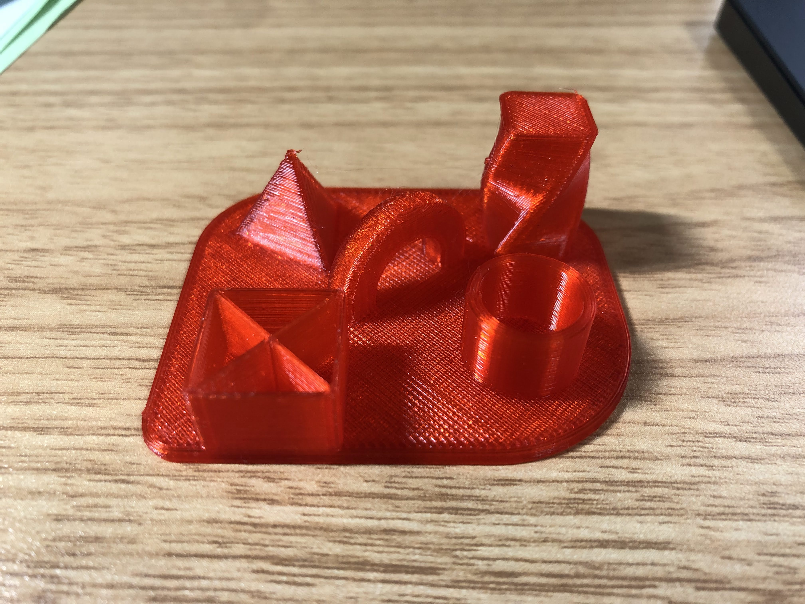

先日VoxelabのAquilaという3Dプリンターを購入しました。以前から欲しいな〜と思っていた3D printerを一人暮らしを始めたしいい機会だと思って購入してみました。3Dプリンター自体は初めてではなく、今まではfab施設の方に3D CADのデータを送って出力作業はお任せしていたので実際に自分で印刷するのは初でした。

Aquilaシリーズの一番廉価モデルで２万円のものなのであまり期待していなかったのですが、届いて組み立ててみるとかなりちゃんとしています。無骨なアルミフレームのフォルムにガラスプレートがついています。かっこいい

試しにDEMOでついているデータを出力してみました。パラメーターの調整なしでもかなり綺麗に出力できています、２万円のプリンターを舐めていました。

 

## CAD

ネット上にあるデータを印刷して遊んでいたのですが、そろそろ自分で作りたくなってきました。ちょうど3D printerをお持ちの方にthinkerCADというweb appを教えていただいたのでこれで遊び始めました。

しばらく遊んでいて思ったことは3D printerの印刷可能性というか

