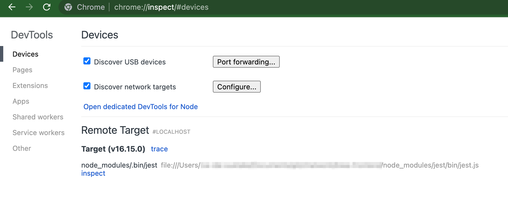
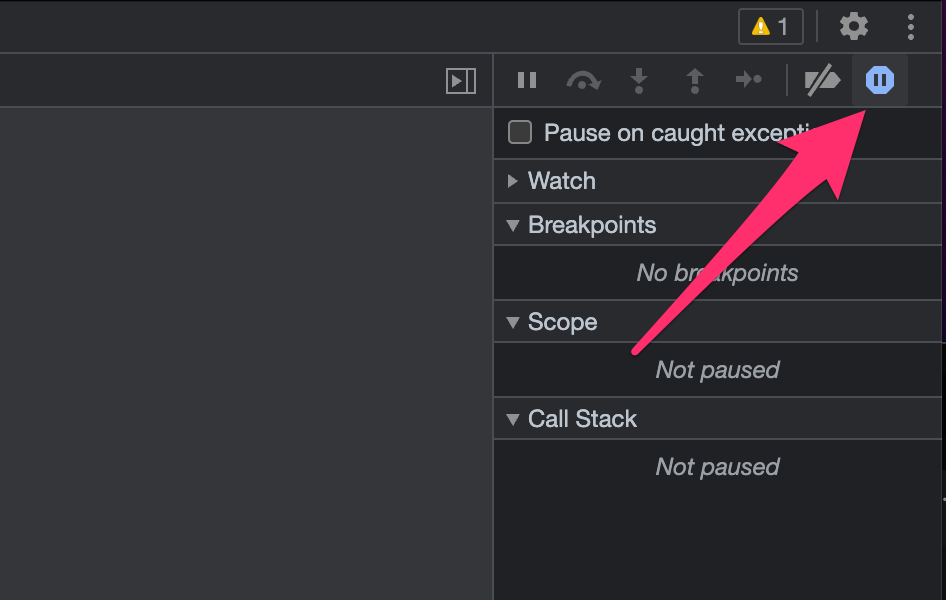
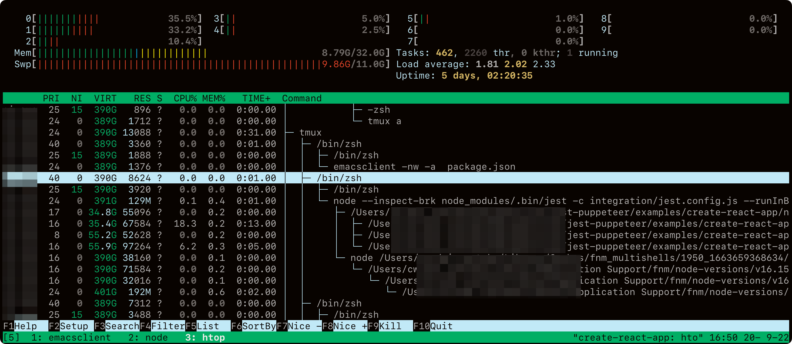

Jest でテストを実行すると

```shell
Ran all test suites matching path\/to\/hoge.spec.ts/i.
Jest did not exit one second after the test run has completed.

This usually means that there are asynchronous operations that weren't stopped in your tests. Consider running Jest with `--detectOpenHandles` to troubleshoot this issue.
```

といった表示とともに全てのテストが Pass になっているのに関わらず Jest のプロセスが数分間終了しない問題に遭遇することがあります。

エラー文で検索すると Puppeteer や DB コネクションの修了処理を忘れていてテスト時に起動した別プロセスが終了していないため、Jest がそれらの終了を待ってしまうことが多いみたいです。

このような場合はツールの修了処理を追加してあげれば改善することが多いのですが、このようなツールを利用していないプロジェクトで起きた場合は原因特定・修正をする必要が出てきます。

## Jest のデバッグ実行

Jest には Chromium 系のブラウザに付いている Dev Tools を利用したトラブルシューティング機能があります。(Node.js の機能ですが Jest はこれを正式にサポートしています)

上記のエラーメッセージと一緒に当該の問題が発生しているテストのファイル名が表示されていると思います。このファイルのみをデバッグ実行して原因を探っていきます。

Jest のドキュメントに従って

```shell
node --inspect-brk node_modules/.bin/jest --runInBand /path/to/sample.spec.js
```

を実行した後、Chromium 系のブラウザで `chrome://inspect` にアクセスすると Remote Target に Jest のプロセスが表示されるので`inspect`をクリックすると見慣れた Dev tools が別ウィンドウで表示されます。



インスペクターは必ず Jest の実行直前で一時停止するようになっているので<kbd><kbd>Ctrl</kbd> + <kbd>p</kbd></kbd>を押して対象のテストファイルを開き問題箇所周辺をデバッグしていくことができます。

割と忘れやすいのが、ブレイクポイントを張り終えた後、再実行しようとターミナルで<kbd>Ctrl + c</kbd>して再実行するとdev toolsとのセッションが切れます。がしかし、**dev toolsの画面は自動で閉じません**。Jestの再実行の後にさっきまでのdev toolsのウィンドウを閉じた後、再び`chrome://inspect`から同様に起動してください。dev toolsの作業内容はウィンドウを閉じても保持されるため新しいウィンドウでもさっき頑張って貼ったブレイクポイントのところでちゃんと止まります。

## デバッグ勘所

私がこのエラーに遭遇した時に行っているデバッグ方法をを紹介します。

### 最初に疑うところ

私の経験則ですが、非同期やイベント周りでエラーや考慮漏れがあるとこのようなエラーになることが多かったです。テストの中で作られた Promose オブジェクトが pending のままになっていたり、Reject を返しているのにそれらを考慮していない時などにもこのようなエラーになったことがあります。

### console.log を眺める

Jest をターミナルで実行している時にも`console.log`は表示されますが、ログが出力された該当箇所へのジャンプは dev tools でないとできません。

ORM ライブラリなどが実行中に出力するログの出力元に何かヒントがある可能性があります。

### catch されていない例外をみる

実行中に例外が投げられており、その例外をキャッチしていない箇所に自動でブレイクポイントを設定できます。[(参考)](https://developer.chrome.com/docs/devtools/javascript/breakpoints/#exceptions)



ここでは try-catch していない Error, Promse.reject があるとそこで実行が止まります。意図していない箇所で止まっている場合にはそこを修正することでテストの実行が改善する可能性があります。

それでも見つからない場合/改善しない場合は"Pause on caught exceptions"にチェックを入れることでtry-catchしている部分ももれなく実行を一時停止することができます。

## Jest上で実行されている別プロセスがないか確認する

testやdescribeの最終行にブレイクポイントを張り実行を一時停止した状態で別のターミナルでhtopなどを用いてJestの子プロセスとして起動中（終了していない）プロセスが残っていないかを確認する

Jestの小プロセスにpuppeteerなどが残っているとこのように`node --inspect-brk ...`の子プロセスに表示されます。



プロセスの終了が行われていれば`node --inspect-brk ...`の子プロセスは１つも表示されなくなります。

## refs

- https://jestjs.io/docs/troubleshooting
- https://developer.chrome.com/docs/devtools/javascript/breakpoints/#exceptions
