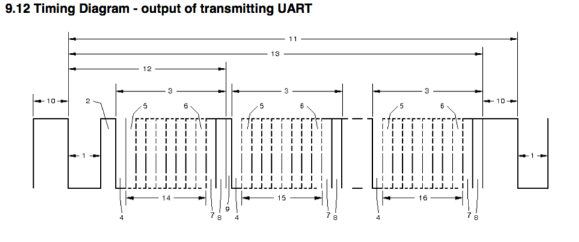

## DMX512-A 仕様

- シールド付きツイストペアケーブルを使用すること
- RS-485 では 1500m までの通信が保証されているが、RS-485 の仕様の中でケーブルの長さを伸ばすと通信速度が下がるとされているので、DMX512-A の通信速度 250kbps が保証されるのはケーブル長 400m までとされている。
- RS-485 の仕様では 1Master で 32Slave までとされている
- DMX512-A のボーレートは 250kpbs なので、1bit あたり 4μsec (※1)a
- 端末にはターミネータ(終端抵抗)をつける DMX512-A では基本的に 120Ω となっている(100-120)と幅を効かせて定義もされている。
- 仕様上では１パケット長が最小で 22.7msec になり、リフレッシュレートは最大で 44Hz になる

※1: 仕様では基本 250kbps としているが 245 ≤ n ≤ 255kbps まで認めているので、1bit は 3.92 ≤ n ≤ 4.08µsec までと幅がある。

## パケット仕様

パケットは以下のフレームで構成されている。

<http://www.iar.unicamp.br/lab/luz/ld/C%EAnica/Manuais/dmx_usit.pdf>

| No. | Frame                     | Time             | Level        |
| --- | ------------------------- | ---------------- | ------------ |
| 1   | "SPACE" for Break         | 88µsec < 1sec ※1 | LOW          |
| 2   | "MARK" After Break (MAB)  | 8µsec≤n<1sec     | HIGH         |
| 3   | START Bit                 | 1bit (4µsec)     | LOW          |
| 4   | SLOT nnn Data             | 8bit (32µsec)    | (0~512 SLOT) |
| 5   | STOP Bit                  | 2bit (8µsec)     | HIGH         |
| 6   | "MARK" Time Between slots | 0sec≤n<1sec      | HIGH         |
| 7   | "MARK" Before Break (MBB) | 0sec≤n<1sec      | HIGH         |

3~6 を 513 回繰り返します。

※1:仕様では 88µsec 以上としか書かれていないが、パケット全体を 1sec 以内に収めることが書かれているので、事実上制限があることになりそう？

この調子で１パケットで 513 SLOT の Data を送信します、この Data を仕様内では SLOT と呼び、最初の 0SLOT は START CODE で 1SLOT が DMX の 1ch,2SLOT が 2ch...

## START CODE

DMX512-A では調光信号の他、イロイロな信号を流せるようになった、この時にこの Start bit に仕様で定義されているコードを送信することで受信側はなんの信号か判断できるようになっているがこのコードをちゃんと識別しれくれない機器もある。RDM 信号流したら安物ムービングがピクピク動くからなんだと思ったら受け取った信号を全て調光信号として受け取る仕様らしく何しても動くやつとかある。
パケットの 0 SLOT に以下の通りのコードを送信すればいいらしい。

| NAME                      | CODE             |
| ------------------------- | ---------------- |
| Lighting Data             | 0x00 (0000 0000) |
| Network Test              | 0x55 (0101 0101) |
| Text Packet               | 0x17 (0001 0111) |
| Remote Device Management  | 0xCC (1100 1100) |
| System Information Packet | 0xCF (1100 1111) |
| Dimmer Curve Select       | 0xFF (1111 1111) |
