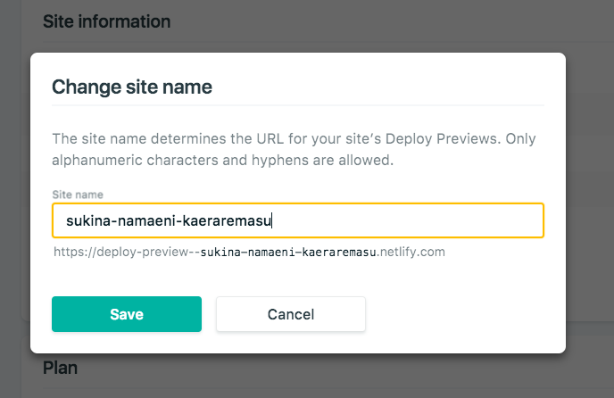
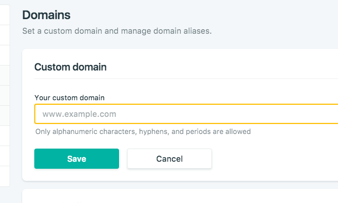
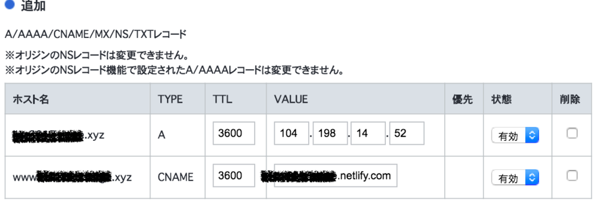
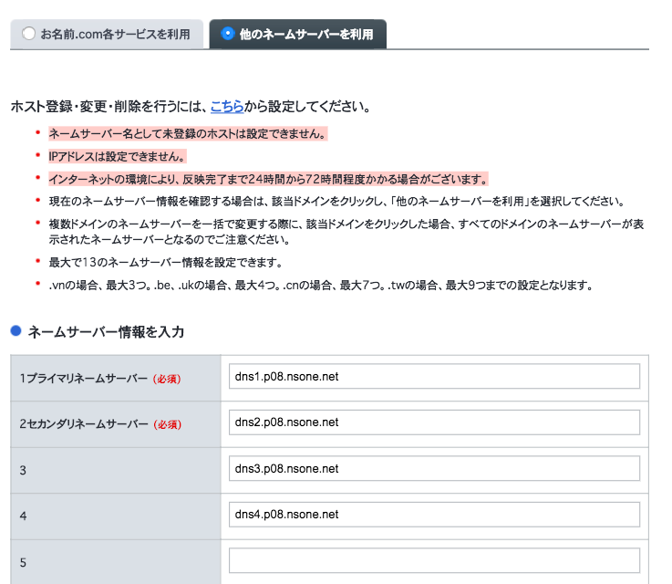
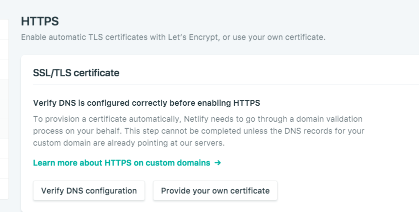

**情報が古く、執筆時の Netlifty の UI 等が変わっています。ご注意を**

## 事の発端

IOS 11 ｷﾀ ━(ﾟ ∀ ﾟ)━! 　 Safari からカメラの映像が取得できる！　これでアプリではなくブラウザから AR できるようになった！と喜んでいたら、このカメラの api は https じゃないとセキュリティ的な問題で動かないのである。

Github pages で独自ドメインでホスティングしているサイトを HTTPS にしたいけどお金はない。

すでに導入レポは検索すればいくつも見つかるものの、どうも日本語の情報が少ないのでメモすることにした。

プログラミング## 使ったもの

- Github
- Netlify
- お名前.com

## 手順

1. お名前.com でドメインを取得します。
2. Github に公開するサイトのファイル一式を push しておきます。

一度 Github pages で公開してみて問題がないことを確認しておきましょう。設定で有効化して、HTTPS にチェックを入れれば\`\``https://<username>.github.io/<repository name>/\`\``でアクセスできます。

2. Netlify に登録します。
   <https://www.netlify.com/>
   Github アカウントでログインし、先ほど push したリポジトリを選択し、デプロイしましょう。
3. Netlify の site name を変更しましょう

デプロイをするとデフォルトでランダムな英単語が割り当てられるので、変更しなくても問題はないが変更しておきましょう。

\`\`\`General -> Setting -> Site details -> Change site name\`\`\` から設定します。

4. カスタムドメインを設定しましょう

\`\`\`Domain management -> Domains -> Custom domain\`\`\` に取得しておいたドメインを設定します。
ここで、Netlify は www 付きのドメインにすることを勧めてきます。DoS 攻撃から守りやすいとか、ロードが早いとか色々恩恵があるらしいのですが、それよりも URL が短くなる方がいいなって思ったので、自分は www なしにしました。

設定後、Netlify の DNS を利用するので \`\`\` Use Netlify DNS \`\`\` を押します。４つ URL が表示されると思います。これは次の作業で使うので覚えときましょう。

5. ドメインの設定をしましょう

今度はお名前.com でドメインの設定をしていきます。

ログイン後、\`\`\` ネームサーバーの設定 -> DNS 関連機能の設定 \`\`\` に A レコードと CNAME を追加します。

- A レコードで 104.198.14.52 を追加します。
- CNAME に www をつけて Netlify で設定した URL を追加します。`<site name>.netlify.com`です

次に、DNS を変更します。

\`\`\` ネームサーバーの設定 -> ネームサーバーの変更 -> 他社のネームサーバーを利用\`\`\` に 4 で Netlify にドメインを設定した時に出てきた４つの DNS の URL を設定します。人によってこの URL は異なるみたいです。

設定が反映されると、独自ドメインにアクセスすると HP が表示されると思います。このままではまだ HTTP です。いよいよ次で HTTPS になります。

6. Netlify で SSL を有効化しましょう

Netlify で \`\`\`Domain management -> Domains -> HTTPS -> SSL/TLS certificate\`\`\`で \`\`\`Verify DNS configration\`\`\`をクリックし\`\`\` Let's Encypt certificate\`\`\`をクリックです。

お疲れ様でした、試しにhttps://でアクセスしてみましょう、表示されれば成功です。セキュリティーがどーたらと表示されてしまう場合はしばらく待ってれば反映されるっぽいです。

最後の仕上げとして、http でアクセスがあった時に https にリダイレクトさせたいので \`\`\`Force TLS connections\`\`\`を有効化して完了です。そんなの表示されてないよって時はリロードするとたぶん出てきます。

\[f:id:MagmaChocolate:20171015023118p:plain]

## コメント

ドメイン周りの設定は順番が大切なので、3 回ぐらい失敗してサイトを消してやり直してを繰り返してしまった。勉強不足だ。
そんなこんなで、準備は整ったので、AR.js とやらに挑戦します。
