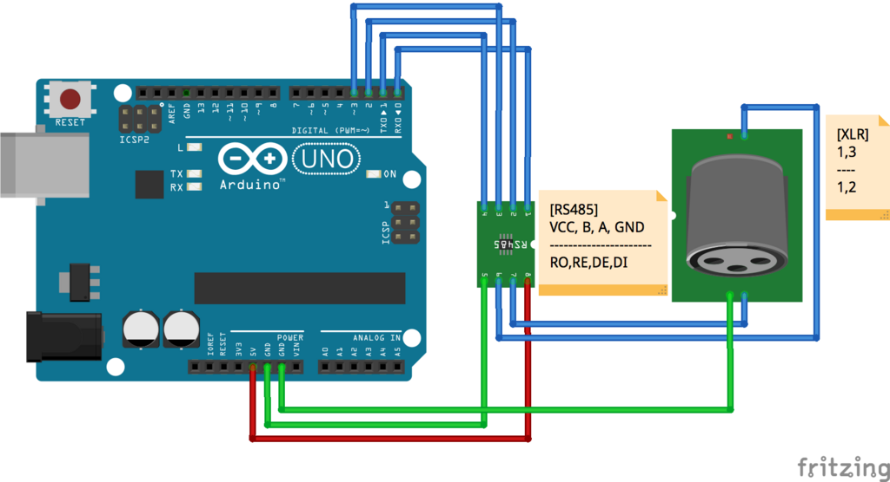

## 部品

- Arduino UNO 互換品
- RS485 モジュール
- XLR コネクター

## 配線



## スケッチ

[DmxSimple](https://github.com/PaulStoffregen/DmxSimple)をとりあえず書き込んでサンプルを動かしてみた。
このライブラリデフォルトの Pin アサインは上の図の通りだが、コード内で別途指定すれば変更できるっぽい。

**SerialToDmx**は PC からのシリアル画面から`{ch番号}c{ゲージ}w`って感じで送ってやれば送信できる、5ch に 255 を出力すると`5c255w`と送信すればいいらしい。

**FadeUp**は Pin アサインがデフォルトから変更されているので、

```
// DmxSimple.usePin(3);
```

しとけばとりあえず動いた。

LTC485 の仕様としてこの図では DE を Arduino のデジタル GPIO のアウトを使って 5V を印加している。この DE を HIGH にすると送信 LOW にすると受信モードになる
